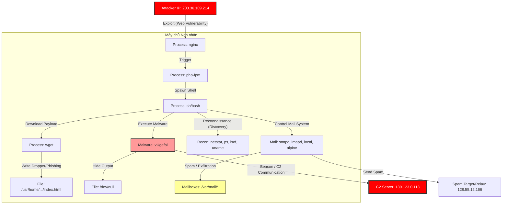

Chào bạn, tôi là chuyên gia điều tra số và phân tích mã độc. Dựa trên dữ liệu Provenance Graph trích xuất từ hệ thống KAIROS mà bạn cung cấp, tôi đã tiến hành phân tích sâu các sự kiện, xâu chuỗi các manh mối và phát hiện ra một cuộc tấn công mạng phức tạp.

Dưới đây là báo cáo chi tiết về cuộc điều tra.

---

# BÁO CÁO ĐIỀU TRA SỐ: PHÂN TÍCH TẤN CÔNG APT TỪ PROVENANCE GRAPH

## 1. TỔNG QUAN & CÁC DẤU HIỆU BẤT THƯỜNG TRỌNG YẾU (CRITICAL FINDINGS)

Dựa trên chỉ số bất thường (`Anomaly Score`) và bản chất của các thực thể, tôi đã khoanh vùng các đối tượng nghi vấn nhất:

### A. Tiến trình lạ & Mã độc tiềm ẩn
*   **`vUgefal` (ID: 17758353093616318491):**
    *   **Dấu hiệu:** Tên tiến trình là một chuỗi ký tự ngẫu nhiên, không phải là tên chuẩn của hệ thống Linux/Unix.
    *   **Hành vi:** Ghi dữ liệu vào `/dev/null` (Loss: 6.38) để ẩn đầu ra và giao tiếp mạng ra ngoài (C2). Đây là dấu hiệu điển hình của **Backdoor hoặc Trojan**.
*   **`wget` (ID: 12320487051717198052):**
    *   **Hành vi:** Tải file về đường dẫn `/usr/home/user/eraseme/www.a7.org/index.html`.
    *   **Phân tích:** Thư mục `eraseme` gợi ý kẻ tấn công muốn xóa dấu vết sau khi dùng, hoặc đây là một thư mục tạm thời để chứa công cụ. File `index.html` có thể là một Defacement (giao diện thay thế) hoặc một Phishing page giả mạo.

### B. Điểm xâm nhập & Khai thác (Exploitation)
*   **`nginx` & `php-fpm`:**
    *   **Hành vi:** `nginx` gửi dữ liệu đến IP lạ `200.36.109.214` và ghi log lỗi với điểm bất thường cao. `php-fpm` ghi đè socket `127.0.0.1:63076`.
    *   **Phân tích:** Kẻ tấn công có thể đã khai thác lỗ hổng **Remote Code Execution (RCE)** trên ứng dụng web chạy PHP để chiếm quyền điều khiển (Web Shell).

### C. Mạng lưới kết nối (C2 & Exfiltration)
*   **IP `139.123.0.113:80`:** Giao tiếp trực tiếp với tiến trình mã độc `vUgefal`. Đây có khả năng cao là máy chủ C2 (Command & Control) của kẻ tấn công.
*   **IP `200.36.109.214:80`:** Giao tiếp với `nginx`. Có thể là IP của kẻ tấn công thực hiện việc khai thác lỗ hổng (Exploit Source).
*   **IP `128.55.12.166` (Nhiều port):** `smtpd` kết nối liên tục tới IP này. Đây có thể là máy chủ mail relay hoặc nạn nhân bị spam.

### D. Hành vi Spam/Gửi thư rác
*   **`local`, `imapd`, `alpine`:** Các tiến trình này có điểm Anomaly Score rất cao khi ghi vào các file mailbox (`/var/mail/bob`, `/var/mail/frank`, `/home/george/Sent`). Điều này cho thấy hệ thống bị biến thành công cụ phát tán Spam hoặc đang bị thu thập dữ liệu email.

---

## 2. DỰNG LẠI KỊCH BẢN TẤN CÔNG (ATTACK SCENARIO RECONSTRUCTION)

Dựa trên dòng thời gian (Timestamp) và logic nhân quả, tôi xây dựng lại kịch bản tấn công qua 4 giai đoạn:

### Giai đoạn 1: Xâm nhập ban đầu (Initial Access)
*   **Thời gian:** Khoảng 2018-04-06.
*   **Sự kiện:** Kẻ tấn công (từ IP `200.36.109.214`) khai thác lỗ hổng trên `nginx` và `php-fpm`.
*   **Chi tiết:** Các tiến trình web server bắt đầu có hành vi lạ như mở kết nối đến `/dev/random` và ghi đè socket nội bộ. Kẻ tấn công đã leo thang từ giao diện web xuống hệ điều hành.

### Giai đoạn 2: Cài đặt Mã độc & Thiết lập C2 (Installation & C2)
*   **Sự kiện:** Xuất hiện tiến trình **`vUgefal`**.
*   **Chi tiết:** Ngay sau khi xâm nhập, tiến trình lạ `vUgefal` được kích hoạt. Nó kết nối ngay lập tức đến IP `139.123.0.113` để nhận lệnh. Nó cũng ghi dữ liệu vào `/dev/null` để tránh lưu log cục bộ.
*   **Công cụ hỗ trợ:** Kẻ tấn công sử dụng `wget` để tải thêm công cụ hoặc trang web lừa đảo (`www.a7.org/index.html`) vào thư mục `/usr/home/user/eraseme/`.

### Giai đoạn 3: Do thám nội bộ (Discovery)
*   **Thời gian:** Khoảng 2018-04-12 đến 2018-04-13.
*   **Sự kiện:** Hàng loạt lệnh hệ thống được thực thi với Anomaly Score cao.
*   **Lệnh:**
    *   `netstat`, `lsof`: Kiểm tra các kết nối mạng và file đang mở.
    *   `ps`, `top`: Kiểm tra các tiến trình đang chạy.
    *   `uname`: Kiểm tra thông tin kernel/hệ điều hành.
    *   `sh` gọi `resolvconf` và `dhclient-script`: Có thể kẻ tấn công đang cố gắng thay đổi cấu hình DNS để chuyển hướng traffic hoặc duy trì kết nối mạng.

### Giai đoạn 4: Hành động theo mục tiêu (Action on Objectives - Spam/Botnet)
*   **Sự kiện:** Hệ thống mail (`smtpd`, `imapd`, `local`, `alpine`) hoạt động bất thường.
*   **Chi tiết:**
    *   Tiến trình `local` (Postfix delivery) ghi liên tục vào mailbox của các user (`bob`, `frank`, `alice`...).
    *   `smtpd` (Sendmail/Postfix daemon) kết nối ra ngoài liên tục tới `128.55.12.166`.
    *   **Kết luận:** Máy chủ đã bị biến thành một **Spambot** gửi thư rác số lượng lớn, hoặc kẻ tấn công đang sử dụng `alpine` (trình duyệt mail dòng lệnh) để đọc và trộm cắp email của người dùng nội bộ.

---

## 3. SƠ ĐỒ HÀNH VI TẤN CÔNG (ATTACK GRAPH)

Dưới đây là biểu đồ Mermaid mô tả luồng tấn công chính:

---

## 4. KẾT LUẬN & KHUYẾN NGHỊ

### Kết luận
Đây là một cuộc tấn công nhiều giai đoạn (Multi-stage Attack).
1.  **Loại hình:** Web Server Compromise dẫn đến cài đặt Backdoor và lợi dụng tài nguyên máy chủ để Spam (Spambot) hoặc Phishing.
2.  **Mức độ nghiêm trọng:** **Rất cao (Critical)**. Kẻ tấn công đã có quyền thực thi mã từ xa (RCE), cài đặt mã độc (`vUgefal`), và kiểm soát hệ thống mail.
3.  **Mã độc:** Tiến trình `vUgefal` là thành phần nguy hiểm nhất cần được cô lập và dịch ngược (reverse engineering).

### Khuyến nghị xử lý
1.  **Cô lập ngay lập tức:** Ngắt kết nối mạng của máy chủ, đặc biệt chặn các IP `139.123.0.113` và `200.36.109.214`.
2.  **Điều tra mã độc:** Thu thập file thực thi của tiến trình `vUgefal` (nếu chưa bị xóa) và file tại đường dẫn `/usr/home/user/eraseme/` để phân tích.
3.  **Kiểm tra Web Log:** Rà soát log của Nginx/PHP vào ngày 2018-04-06 để tìm payload khai thác cụ thể.
4.  **Dọn dẹp:** Kill các tiến trình lạ, xóa các file do `wget` tải về.
5.  **Vá lỗ hổng:** Cập nhật phiên bản mới nhất cho Nginx và PHP-FPM, kiểm tra code web để vá lỗ hổng upload hoặc injection.
6.  **Reset thông tin:** Đổi toàn bộ mật khẩu người dùng (do email có thể đã bị đọc) và các tài khoản quản trị.